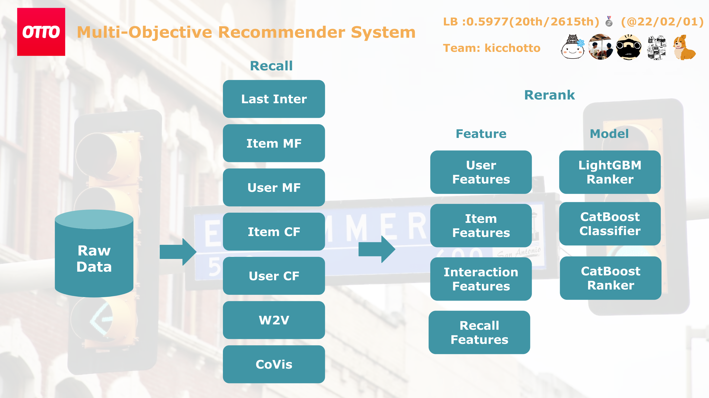

# kaggle-otto2

Our 20th place solution of the Kaggle OTTO – Multi-Objective Recommender System competition

## Code Structure


## Solution Summary



Solution details are written in the Kaggle Discussion: https://www.kaggle.com/competitions/otto-recommender-system/discussion/382771

## 3 Types of experiment environment

My code has 3 expriment environemt
1. dev: For faster local experiment. With 1/20 sampled cv data (e.g. `./yaml/exp001_dev.yaml`)
2. cv: For local experiment and validation (e.g. `./yaml/exp001_cv.yaml`)
3. lb: For submission (e.g. `./yaml/exp001_lb.yaml`)

## Procedure

Please see `./demo.ipynb` for the execution log example

### 000. Setup poetry

```bash
# Install packages
poetry install

# Get into virtual env
poetry shell
```

### 000. Download datasets

```bash
# Download datasets
# ※ ~/kaggle/.kaggle.json with your Kaggle API Key is required
./bin/000_download.sh
```

### 001. Preprocess

```bash
./bin/001_preprocess.sh exp001_dev
```

### 002. Candidate Generation

```bash
./bin/002_candidate_generation.sh exp001_dev
```

### 003. Feature Engineering

```bash
./bin/003_feature_engineering.sh exp001_dev
```

### 004. Train Ranker

```bash
./bin/004_train_ranker.sh exp001_dev lgbm
```
